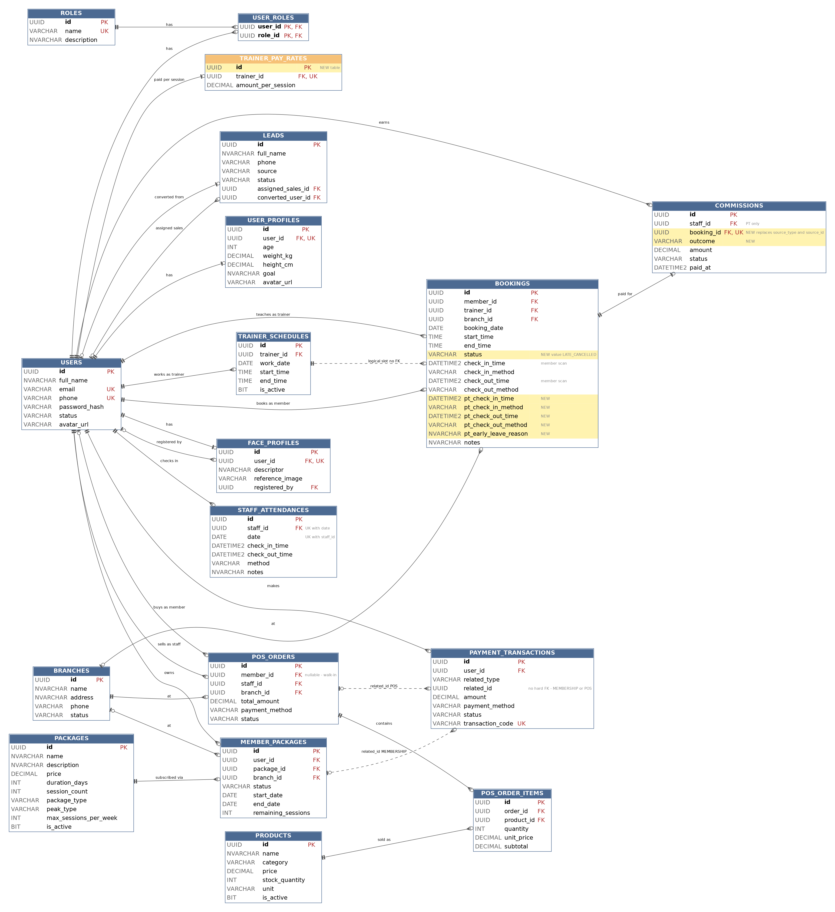

# ERD Tổng quát — Gym Management System (GMS)

> Dựng lại từ **migration Flyway thật** (nguồn đáng tin cậy nhất, trực tiếp tạo bảng trong DB),
> không phải chỉ dựa theo `DATABASE_SCHEMA.md` thiết kế ban đầu. Tính đến thời điểm viết file này:
> **Agent 1, 2, 3, 4 đã có migration thật** (`V1`, `V2`/`V2_1`/`V2_2`, `V3`, `V4` — V3/V4 hiện nằm
> trên nhánh riêng, chưa merge `main`). **Agent 5, 6 chưa code** — phần của họ trong file này lấy
> nguyên theo thiết kế gốc `DATABASE_SCHEMA.md`, đánh dấu rõ **chưa triển khai thật**.

---

## 1. Sơ đồ ERD 

> **Cách đọc:**
> - Đường liền = FK thật trong DB. Đường đứt (`..`) = quan hệ logic, **không** có FK cứng.
> - Phía bên trái ghi `|o` nghĩa là FK **nullable** (con có thể không có cha). `||` nghĩa là bắt buộc.
> - Chú thích `NEW` = cột/bảng **chưa có trong migration thật**, đến từ `CHANGE_PT_ATTENDANCE_AND_PAY.md`.
>   Khi migration tương ứng merge thì bỏ chữ `NEW`.
> - Sơ đồ lược bỏ `created_at`/`updated_at` ở mọi bảng (chủ ý, xem mục 3 để biết bảng nào có thật).

```mermaid
erDiagram
    ROLES ||--o{ USER_ROLES : has
    USERS ||--o{ USER_ROLES : has
    USERS ||--o| USER_PROFILES : has
    USERS ||--o{ MEMBER_PACKAGES : owns
    USERS ||--o{ PAYMENT_TRANSACTIONS : makes
    USERS ||--o{ TRAINER_SCHEDULES : "works as trainer"
    USERS ||--o{ BOOKINGS : "books as member"
    USERS ||--o{ BOOKINGS : "teaches as trainer"
    USERS ||--o| FACE_PROFILES : has
    USERS |o--o{ FACE_PROFILES : "registered by"
    USERS ||--o{ STAFF_ATTENDANCES : "checks in"
    USERS |o--o{ POS_ORDERS : "buys as member"
    USERS ||--o{ POS_ORDERS : "sells as staff"
    USERS ||--o| TRAINER_PAY_RATES : "paid per session"
    USERS ||--o{ COMMISSIONS : earns
    USERS |o--o{ LEADS : "assigned sales"
    USERS |o--o| LEADS : "converted from"

    BRANCHES |o--o{ MEMBER_PACKAGES : at
    BRANCHES |o--o{ BOOKINGS : at
    BRANCHES ||--o{ POS_ORDERS : at

    PACKAGES ||--o{ MEMBER_PACKAGES : "subscribed via"
    MEMBER_PACKAGES |o..o{ PAYMENT_TRANSACTIONS : "related_id MEMBERSHIP"
    POS_ORDERS |o..o{ PAYMENT_TRANSACTIONS : "related_id POS"
    TRAINER_SCHEDULES ||..o{ BOOKINGS : "logical slot no FK"

    PRODUCTS ||--o{ POS_ORDER_ITEMS : "sold as"
    POS_ORDERS ||--o{ POS_ORDER_ITEMS : contains
    BOOKINGS ||--o| COMMISSIONS : "paid for"

    ROLES {
        UUID id PK
        VARCHAR name UK
        NVARCHAR description
    }
    USERS {
        UUID id PK
        NVARCHAR full_name
        VARCHAR email UK
        VARCHAR phone UK
        VARCHAR password_hash
        VARCHAR status
        VARCHAR avatar_url
    }
    USER_ROLES {
        UUID user_id PK, FK
        UUID role_id PK, FK
    }
    BRANCHES {
        UUID id PK
        NVARCHAR name
        NVARCHAR address
        VARCHAR phone
        VARCHAR status
    }
    USER_PROFILES {
        UUID id PK
        UUID user_id FK, UK
        INT age
        DECIMAL weight_kg
        DECIMAL height_cm
        NVARCHAR goal
        VARCHAR avatar_url
    }
    PACKAGES {
        UUID id PK
        NVARCHAR name
        NVARCHAR description
        DECIMAL price
        INT duration_days
        INT session_count
        VARCHAR package_type
        VARCHAR peak_type
        INT max_sessions_per_week
        BIT is_active
    }
    MEMBER_PACKAGES {
        UUID id PK
        UUID user_id FK
        UUID package_id FK
        UUID branch_id FK
        VARCHAR status
        DATE start_date
        DATE end_date
        INT remaining_sessions
    }
    PAYMENT_TRANSACTIONS {
        UUID id PK
        UUID user_id FK
        VARCHAR related_type
        UUID related_id "no hard FK - MEMBERSHIP or POS"
        DECIMAL amount
        VARCHAR payment_method
        VARCHAR status
        VARCHAR transaction_code UK
    }
    TRAINER_SCHEDULES {
        UUID id PK
        UUID trainer_id FK
        DATE work_date
        TIME start_time
        TIME end_time
        BIT is_active
    }
    BOOKINGS {
        UUID id PK
        UUID member_id FK
        UUID trainer_id FK
        UUID branch_id FK
        DATE booking_date
        TIME start_time
        TIME end_time
        VARCHAR status "NEW value LATE_CANCELLED"
        DATETIME2 check_in_time "member scan"
        VARCHAR check_in_method
        DATETIME2 check_out_time "member scan"
        VARCHAR check_out_method
        DATETIME2 pt_check_in_time "NEW"
        VARCHAR pt_check_in_method "NEW"
        DATETIME2 pt_check_out_time "NEW"
        VARCHAR pt_check_out_method "NEW"
        NVARCHAR pt_early_leave_reason "NEW"
        NVARCHAR notes
    }
    FACE_PROFILES {
        UUID id PK
        UUID user_id FK, UK
        NVARCHAR descriptor
        VARCHAR reference_image
        UUID registered_by FK
    }
    STAFF_ATTENDANCES {
        UUID id PK
        UUID staff_id FK "UK with date"
        DATE date "UK with staff_id"
        DATETIME2 check_in_time
        DATETIME2 check_out_time
        VARCHAR method
        NVARCHAR notes
    }
    PRODUCTS {
        UUID id PK
        NVARCHAR name
        VARCHAR category
        DECIMAL price
        INT stock_quantity
        VARCHAR unit
        BIT is_active
    }
    POS_ORDERS {
        UUID id PK
        UUID member_id FK "nullable - walk-in"
        UUID staff_id FK
        UUID branch_id FK
        DECIMAL total_amount
        VARCHAR payment_method
        VARCHAR status
    }
    POS_ORDER_ITEMS {
        UUID id PK
        UUID order_id FK
        UUID product_id FK
        INT quantity
        DECIMAL unit_price
        DECIMAL subtotal
    }
    TRAINER_PAY_RATES {
        UUID id PK "NEW table"
        UUID trainer_id FK, UK
        DECIMAL amount_per_session
    }
    COMMISSIONS {
        UUID id PK
        UUID staff_id FK "PT only"
        UUID booking_id FK, UK "NEW replaces source_type and source_id"
        VARCHAR outcome "NEW"
        DECIMAL amount
        VARCHAR status
        DATETIME2 paid_at
    }
    LEADS {
        UUID id PK
        NVARCHAR full_name
        VARCHAR phone
        VARCHAR source
        VARCHAR status
        UUID assigned_sales_id FK
        UUID converted_user_id FK
    }
```

---

## 2. Trạng thái triển khai từng bảng

| Bảng | Agent | Migration | Trạng thái |
|---|---|---|---|
| `roles`, `users`, `user_roles`, `branches` | 1 | `V1__init_schema.sql` | ✅ Đã merge `main` |
| `user_profiles` | 1 | `V2_1__user_profiles.sql` | ✅ Đã merge `main` |
| `packages`, `member_packages` | 2 | `V2__membership.sql` | ✅ Đã merge `main` |
| `payment_transactions` | 2 | `V2_2__payment_transactions.sql` | ✅ Đã merge `main` |
| `trainer_schedules`, `bookings` | 3 | `V3__schedule_booking.sql` | ⚠️ **Có migration thật, nằm trên nhánh riêng `feature/agent3-schedule-booking`, chưa merge `main`** |
| `face_profiles`, `staff_attendances` | 4 | `V4__face_attendance.sql` | ⚠️ **Có migration thật, nằm trên nhánh riêng `feature/agent4-face-attendance`, chưa merge `main`** |
| `products`, `pos_orders`, `pos_order_items`, `commissions`, `trainer_pay_rates` 🆕 | 5 | `V5__pos_commission.sql` | ❌ **Chưa triển khai — theo thiết kế gốc `DATABASE_SCHEMA.md`, chưa code, chưa migration thật** |
| `leads` | 6 | `V6__leads.sql` | ❌ **Chưa triển khai — theo thiết kế gốc `DATABASE_SCHEMA.md`, chưa code, chưa migration thật** |

---

## 3. Thay đổi so với `DATABASE_SCHEMA.md` gốc (phát hiện khi đối chiếu migration thật)

| # | Bảng | Thay đổi | Lý do (ghi chú ngay trong file SQL) |
|---|---|---|---|
| 1 | `payment_transactions` | Tách thành migration riêng `V2_2`, không nằm trong `V2` base như tài liệu gốc ngụ ý | `V2` chỉ là "bản tối thiểu" ban đầu, Agent 2 bổ sung bảng này sau |
| 2 | `payment_transactions` | Thêm cột `updated_at` (nullable) | `DATABASE_SCHEMA.md` gốc chỉ có `created_at` — entity extends `BaseEntity` (có `@LastModifiedDate`) nên bắt buộc phải có cột tương ứng, không thì Hibernate schema-validation lỗi lúc khởi động |
| 3 | `trainer_schedules` | Có `updated_at NOT NULL DEFAULT SYSUTCDATETIME()` | Tài liệu gốc không liệt kê cột này cho bảng `trainer_schedules` — nhiều khả năng cùng lý do `BaseEntity` như mục 2 |
| 4 | `face_profiles` | Có thêm cột `reference_image` (nullable) | Tài liệu gốc chỉ "đề xuất tuỳ chọn" cột này ("nếu muốn lưu ảnh gốc làm bằng chứng") — Agent 4 đã quyết định thêm vào |
| 5 | `bookings` | Không có `UNIQUE` constraint cứng cho `(trainer_id, booking_date, start_time)` | Cố ý — logic "1 người/slot/PT" kiểm soát ở tầng service (`BookingServiceImpl`), không phải DB constraint, để không chặn nhầm khi có booking lịch sử đã `CANCELLED` trùng slot |
| 6 | `staff_attendances` | Thiếu `updated_at` trong migration ban đầu — **đã xác nhận đúng** là bug (entity `StaffAttendance.java extends BaseEntity`, cần cột tương ứng) và **Agent 4 đã sửa trực tiếp** `V4__face_attendance.sql` (nhánh chưa merge `main` nên sửa thẳng, không cần `V4_1`), thêm `updated_at DATETIME2 NULL` | Đây là dự đoán ở bản trước của file này, nay đã được Agent 4 xác nhận + khắc phục — bug thật, cùng loại với mục 2 (`payment_transactions`), xảy ra độc lập ở 2 agent khác nhau |

**Bài học chung rút ra (đề xuất của Agent 4):** bất kỳ entity nào `extends BaseEntity` đều bắt
buộc migration phải có đủ cả `created_at` **và** `updated_at` — lỗi này đã xảy ra độc lập với cả
Agent 2 (`payment_transactions`) lẫn Agent 4 (`staff_attendances`), và quan trọng là **cả 2 lần
đều không bị `mvn clean verify` bắt được** vì unit test dùng Mockito thuần, không khởi động
`ApplicationContext` nên không chạy qua bước Hibernate schema-validation. Nhiều khả năng Agent 5/6
sau này cũng dễ dính — nên cân nhắc thêm 1 dòng kiểm tra riêng việc này vào checklist review PR
(`CONTRIBUTING.md` mục 7).

---

## 4. Quy ước chung xuyên suốt DB 

- **Engine:** SQL Server 2022, cú pháp T-SQL thuần (không dùng cú pháp PostgreSQL).
- **Khoá chính:** `UNIQUEIDENTIFIER` (`NEWID()`) cho mọi bảng.
- **Timestamp:** `DATETIME2` (`SYSUTCDATETIME()`), xử lý timezone `Asia/Ho_Chi_Minh` ở tầng ứng dụng (BaseEntity dùng `LocalDateTime`, không dùng `Instant`, tránh lỗi `datetimeoffset`).
- **Text:** `NVARCHAR` cho nội dung có dấu tiếng Việt; `VARCHAR` cho mã/email/enum trạng thái (ASCII).
- **Enum trạng thái:** luôn lưu dạng `VARCHAR`, **không** dùng `CHECK` constraint cứng — dễ mở rộng giá trị về sau mà không cần đổi kiểu cột.
- **Quan hệ "polymorphic thủ công"** (không FK cứng, chỉ có cặp `*_type` + `*_id`): `payment_transactions.related_id` (trỏ `member_packages` hoặc `pos_orders`), (`commissions` không còn polymorphic: hoa hồng Sales đã bỏ, chỉ còn PT nên dùng `booking_id` FK thật).

---

## 5. Danh sách giá trị enum đã biết (tổng hợp từ migration + `REQUIREMENTS.md`)

| Cột | Giá trị |
|---|---|
| `users.status` | `ACTIVE`, `INACTIVE`, `BANNED` |
| `branches.status` | `ACTIVE`, `CLOSED` |
| `packages.package_type` | `TIME_BASED`, `SESSION_BASED`, `PT_1ON1` |
| `packages.peak_type` | `OFF_PEAK`, `FULL_TIME` |
| `member_packages.status` | `PENDING`, `ACTIVE`, `EXPIRED`, `SCHEDULED`, `CANCELLED` |
| `payment_transactions.related_type` | `MEMBERSHIP`, `POS` |
| `payment_transactions.payment_method` | `CASH`, `LOCAL_CONFIRM` |
| `payment_transactions.status` | `PENDING`, `SUCCESS`, `FAILED` |
| `bookings.status` | `PENDING`, `CONFIRMED`, `COMPLETED`, `CANCELLED`, `NO_SHOW`, `PT_NO_SHOW`, `LATE_CANCELLED` 🆕 |
| `bookings.check_in_method` / `check_out_method` / `pt_check_in_method` / `pt_check_out_method` | `FACE` |
| `staff_attendances.method` | `MANUAL`, `FACE` |
| `commissions.outcome` 🆕 *(chưa triển khai)* | `COMPLETED`, `MEMBER_NO_SHOW`, `LATE_CANCEL` |
| `commissions.status` *(chưa triển khai)* | `PENDING`, `PAID` |
| `leads.status` *(chưa triển khai)* | `NEW`, `CONTACTED`, `CONVERTED`, `LOST` |
| `pos_orders.status` *(chưa triển khai)* | theo thiết kế gốc, chưa có migration thật để xác nhận tên cột status cụ thể |

---

## 6. Nguồn dữ liệu dùng để dựng file này

- Migration thật: `V1__init_schema.sql`, `V2__membership.sql`, `V2_1__user_profiles.sql`,
  `V2_2__payment_transactions.sql`, `V3__schedule_booking.sql` (nhánh `feature/agent3-schedule-booking`),
  `V4__face_attendance.sql` (nhánh `feature/agent4-face-attendance`).
- Phần Agent 5/6: lấy nguyên theo `DATABASE_SCHEMA.md` gốc (chưa có migration thật để đối chiếu).
- Khi Agent 3/4 merge vào `main`, và khi Agent 5/6 bắt đầu code, cần cập nhật lại mục 2 và mục 3
  của file này cho khớp thực tế.

## 7. Đã qua rà soát chéo

- **Agent 3** (`REVIEW_ERD_TONG_QUAT.md`): xác nhận phần `trainer_schedules`/`bookings` (mục V3)
  chính xác 100% so với migration + entity thật, đối chiếu từng dòng.
- **Agent 4** (`AGENT4_RESPONSE_TO_ERD.md`): xác nhận đúng dự đoán về `staff_attendances` thiếu
  `updated_at`, đã sửa trực tiếp trong migration (xem mục 3, dòng #6).

---

## 8. Thay đổi dự kiến (từ `CHANGE_PT_ATTENDANCE_AND_PAY.md`, chưa có trong migration)

| # | Bảng | Thay đổi | Agent |
|---|---|---|---|
| 1 | `bookings` | Thêm `pt_check_in_time`, `pt_check_in_method`, `pt_check_out_time`, `pt_check_out_method`, `pt_early_leave_reason` (sửa thẳng `V3` vì chưa merge) | 3 |
| 2 | `bookings.status` | Thêm giá trị `LATE_CANCELLED` (cột `VARCHAR`, không cần migration) | 3 |
| 3 | `trainer_pay_rates` | Bảng mới, `trainer_id` UNIQUE, `amount_per_session` — lương PT mỗi buổi | 5 |
| 4 | `commissions` | Chỉ còn PT: bỏ `type`, `source_type`, `source_id`; thêm `booking_id` FK **UNIQUE** (mỗi buổi chỉ trả công một lần) và `outcome` | 5 |
| 5 | `leads` | Không đổi cấu trúc; chuyển đổi lead không còn sinh hoa hồng | 6 |

## 9. Điểm cần kiểm tra trước khi vẽ bản cuối

1. **`UNIQUE` trên cột nullable (SQL Server chỉ cho đúng một `NULL`).** `users.phone` và `payment_transactions.transaction_code` đang đánh dấu UK. Nếu hai cột này nullable thì bản ghi thứ hai có `NULL` sẽ vi phạm unique. Cần mở `V1` và `V2_2` kiểm tra; nếu đúng thì đổi sang filtered index, ví dụ `CREATE UNIQUE INDEX uq_users_phone ON users(phone) WHERE phone IS NOT NULL;`.
2. **`avatar_url` có ở cả `users` và `user_profiles`.** Vi phạm nguyên tắc một nguồn chân lý. Chọn một nơi (mình nghiêng về `user_profiles`, vì API avatar nằm dưới `/profile/me/avatar`) rồi bỏ cột còn lại.
3. **`updated_at` không đồng nhất:** `trainer_schedules`, `bookings` là `NOT NULL DEFAULT`, còn `payment_transactions`, `staff_attendances` là `NULL`. Không gây lỗi nhưng nên thống nhất một kiểu.
4. **Chưa thấy `ON DELETE` ở bất kỳ FK nào** (mặc định `NO ACTION`). Chấp nhận được nếu hệ thống xoá mềm qua `users.status`; ghi rõ điều đó vào mục 4.
5. **Chỉ mục nên có:** `member_packages (user_id, status)` (mọi lần gọi `getCurrentMembership`), `payment_transactions (related_type, related_id)`, `commissions (staff_id, status)`.
6. **Tuỳ chọn:** thêm `bookings.member_package_id` (FK nullable) để biết buổi nào trừ vào gói nào, hữu ích khi tra soát "mất 1 buổi" sau nâng/hạ cấp.
7. **Lỗi thiếu `updated_at` không bị `mvn verify` bắt** vì test dùng Mockito thuần. Nên thêm một smoke test khởi động `ApplicationContext` với SQL Server container và `ddl-auto=validate`, đồng thời dùng làm bước CI.
