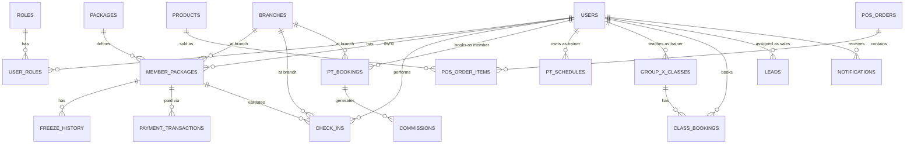

# ERD chi tiết (Mermaid)

> Render trực tiếp trên GitHub hoặc bằng mermaid.live. Bản đầy đủ hơn ERD tóm tắt trong DATABASE_SCHEMA.md.

```mermaid
erDiagram
    ROLES ||--o{ USER_ROLES : has
    USERS ||--o{ USER_ROLES : has
    USERS ||--o{ MEMBER_PACKAGES : owns
    PACKAGES ||--o{ MEMBER_PACKAGES : "defines"
    MEMBER_PACKAGES ||--o{ FREEZE_HISTORY : has
    MEMBER_PACKAGES ||--o{ PAYMENT_TRANSACTIONS : "paid via"
    USERS ||--o{ CHECK_INS : performs
    MEMBER_PACKAGES ||--o{ CHECK_INS : validates
    USERS ||--o{ PT_BOOKINGS : "books as member"
    USERS ||--o{ PT_SCHEDULES : "owns as trainer"
    PT_BOOKINGS ||--o{ COMMISSIONS : generates
    USERS ||--o{ GROUP_X_CLASSES : "teaches as trainer"
    GROUP_X_CLASSES ||--o{ CLASS_BOOKINGS : has
    USERS ||--o{ CLASS_BOOKINGS : books
    PRODUCTS ||--o{ POS_ORDER_ITEMS : "sold as"
    POS_ORDERS ||--o{ POS_ORDER_ITEMS : contains
    USERS ||--o{ LEADS : "assigned as sales"
    USERS ||--o{ NOTIFICATIONS : receives
    BRANCHES ||--o{ MEMBER_PACKAGES : "at branch"
    BRANCHES ||--o{ CHECK_INS : "at branch"
    BRANCHES ||--o{ PT_BOOKINGS : "at branch"
```
